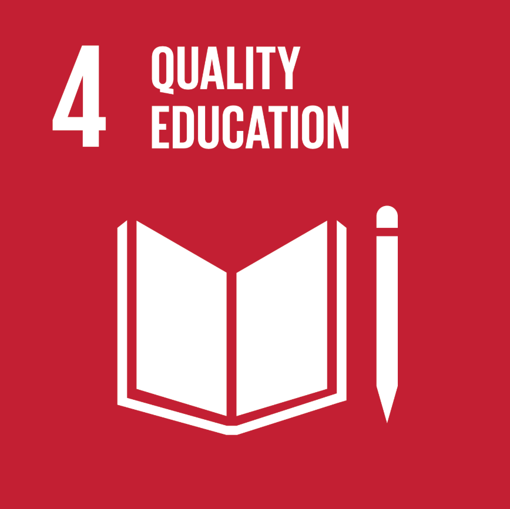

# SDG #4 Quality Education

 {width="50%"}

SDG #4 calls for "inclusive and equitable quality education" and lifelong learning for all (Unterhalter, [2019](#E)). Its targets span early childhood through adulthood and include the promotion of gender equality — connecting it directly to SDG #5. Despite decades of international commitment, real functional progress toward equitable and quality education in the developing world has been limited. Reports have found that nine in ten children in low-income countries cannot read with comprehension by age ten (Beeharry, [2021](#F)). The author argues that the problem is not in the lack of intention, but instead a failure to design and implement effective functional solutions. Without rigorous, system-wide effort, Beeharry warns, SDG #4's target of twelve years of schooling for every girl by 2030 will not be met ([2021](#F)). Unterhalter ([2019](#E)) cautions that expanding educational access alone is insufficient. Education systems can reproduce the very inequalities they aim to address, particularly along lines of gender. Meaningful progress on SDG #4 therefore requires not just greater access to schooling, but a shift toward greater equitability in schooling systems — a distinction with direct consequences for women's empowerment and progress towards SDG #5 (Unterhalter, [2019](#E)).
