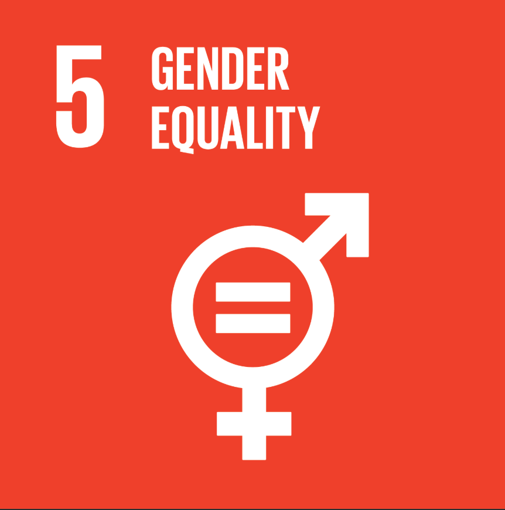

# SDG #5 Gender Equality

{width="50%"}

Sustainable Development Goal #5 aims to empower women and girls by eliminating gender disparities, discrimination, and violence (Eden & Wagstaff, [2021](#A)). Gender equality, as Küfeoğlu ([2022](#B)) describes it, is foundational to equitable development. Issues in gender equality include the elimination of gender-based violence, promoting equal pay, equal employment opportunity, and equal representation in education (Küfeoğlu, [2022](#B)). Progress remains slow and discriminatory laws and gender norms continue to restrict women’s access to education and careers globally (UNDESA, [2025](#C)). Women are paid roughly 16% less than men, and in approximately 90 countries women perform domestic and nursing labor without compensation. Statistics from 2017 show that 21% of women aged 20–24 had been married before age 18, limiting their educational and economic opportunities (Küfeoğlu, [2022](#B)). Eden and Wagstaff ([2021](#A)) characterize SDG #5 as a "wicked problem" — one with no universal remedy, especially across diverse cultural contexts. Even so, they stress that complexity is not an excuse for inaction. Studies have shown that economic investment in developing nations can drive female empowerment, but only when paired with equitable education systems — pointing directly to the interdependence of SDGs #4 and #5 (Roy & Xiaoling, [2022](#D)). 
